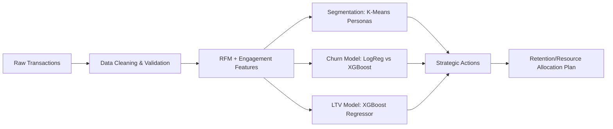

# Customer Segmentation & Retention Analysis

This project builds a production-minded customer segmentation and retention system using the Kaggle Online Retail dataset. It avoids tutorial-style shortcuts by forcing realistic data cleaning, explicit trade-offs, and business-focused evaluation.

## What You Get
- Data pipeline that cleans messy transactional data and documents key trade-offs.
- RFM and engagement proxy features derived from raw transactions.
- Hybrid modeling: segmentation (K-Means), churn prediction (Logistic Regression + XGBoost), and LTV regression (XGBoost).
- MLflow experiment tracking for reproducibility.
- FastAPI service to serve predictions and strategic actions.
- Strategic recommendation report grounded in segment behavior.

## Flowchart


## Trade-Offs (Documented)
- **Missing CustomerID rows dropped**: avoids segment leakage from anonymous purchases.
- **Canceled invoices removed**: keeps signals aligned with real revenue.
- **No session features**: dataset lacks sessions, so engagement proxies (avg interpurchase days, purchase span) are used instead.
- **Time-based split**: models train on past and validate on future behavior to reduce leakage.

## Structure
- `src/`: data pipeline, feature engineering, modeling, reporting.
- `app/`: FastAPI app + Streamlit dashboard.
- `artifacts/`: saved models, feature store, segment summaries.
- `reports/`: strategic recommendation report.
- `dataset/OnlineRetail.csv`: dataset (copied from `datasets/` if present).

## Setup
```bash
pip install -r requirements.txt
```

## Run Training Pipeline
```bash
python src/train_pipeline.py
```

Outputs:
- `artifacts/feature_store.csv`
- `artifacts/segment_summary.csv`
- `artifacts/*.joblib`
- `reports/strategic_report.md`
- `mlruns/` (MLflow experiment tracking)

## Run API
```bash
uvicorn app.main:app --reload
```

### Example Request
```bash
curl -X POST "http://127.0.0.1:8000/predict" ^
  -H "Content-Type: application/json" ^
  -d "{\"customer_id\": 17850}"
```

Or send features directly:
```bash
curl -X POST "http://127.0.0.1:8000/predict" ^
  -H "Content-Type: application/json" ^
  -d "{\"features\": {\"recency_days\": 12, \"frequency\": 5, \"monetary\": 520, \"avg_basket_value\": 104, \"unique_products\": 12, \"avg_interpurchase_days\": 30, \"purchase_span_days\": 120}}"
```

## Web Dashboard (Upload + Retrain)
```bash
streamlit run app/dashboard.py
```

### Column Mapping (JSON)
When uploading a company dataset with different column names, provide a JSON mapping:
```json
{
  "customer_id": "ClientNumber",
  "order_id": "TxnID",
  "order_datetime": "PurchaseDate",
  "product_id": "SKU",
  "quantity": "Units",
  "unit_price": "Price"
}
```
If the dataset has only an order total, use:
```json
{
  "customer_id": "ClientNumber",
  "order_id": "TxnID",
  "order_datetime": "PurchaseDate",
  "product_id": "SKU",
  "order_total": "OrderTotal"
}
```

## Business Evaluation (Beyond F1)
Churn model evaluation includes a **business cost function**:
- False positives incur incentive cost.
- False negatives lose future value.
This cost is logged to MLflow as `business_cost`.

## Strategic Recommendation Report
`reports/strategic_report.md` summarizes each segment’s value, churn risk, and recommended action:
- Early access + loyalty perks for high-value, low-risk users.
- Targeted retention incentives for valuable but at-risk users.
- Low-touch win-back or deprioritize for low-value, high-risk users.

## Drift Detection & Retraining Plan
- **Monitoring cadence**: Weekly data checks, monthly model evaluation, quarterly retraining or sooner if drift triggers.
- **Feature drift**: Compare rolling distributions of RFM features with Population Stability Index (PSI) and KS tests.
- **Prediction drift**: Track churn probability calibration and LTV error against recent cohorts.
- **Trigger thresholds**: PSI > 0.2 or AUC drop > 10% from baseline.
- **Action**: Rebuild features, retrain models with most recent 12–18 months, and re-log to MLflow.
