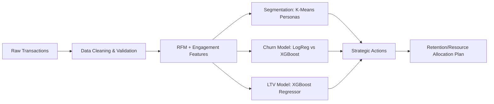

# Customer Segmentation & Retention Analysis

## 📌 Project Overview

This project is an end-to-end Data Science solution designed to analyze customer behavior, segment customers based on their transactional history, and predict churn and Lifetime Value (LTV). It enables businesses to move from raw messy data to actionable strategic insights.

The system includes a robust data processing pipeline, a Machine Learning backend (serving predictions via FastAPI), and two user interfaces: a strategic Streamlit dashboard for data scientists/analysts and a modern Next.js frontend for business users.

## 🏗 Architecture Flow



## 🚀 Key Features

*   **Automated Data Pipeline:** Cleans and standardizes raw transactional data (handling missing values, cancellations, etc.).
*   **Feature Engineering:** Calculates Recency, Frequency, Monetary (RFM) metrics and engagement proxies.
*   **Customer Segmentation:** Uses K-Means clustering to identify distinct customer personas.
*   **Predictive Modeling:**
    *   **Churn Prediction:** Compares Logistic Regression and XGBoost to identify at-risk customers.
    *   **LTV Estimation:** Predicts future customer value using XGBoost Regression.
*   **Experiment Tracking:** Uses MLflow to track model performance and artifacts.
*   **API Deployment:** Exposes model predictions via a high-performance FastAPI backend.
*   **Dual Interfaces:**
    *   **Streamlit Dashboard:** For model training, evaluation, and strategic reporting.
    *   **Next.js App:** A polished UI for viewing customer predictions and segment insights.

## 🛠 Tech Stack

| Component | Technology | Description |
| :--- | :--- | :--- |
| **Language** | Python 3.10+ | Core logic and data processing. |
| **Data Processing** | Pandas, NumPy | Data manipulation and vectorization. |
| **Machine Learning** | Scikit-learn, XGBoost | Modeling (Clustering, Classification, Regression). |
| **Tracking** | MLflow | Experiment tracking and model registry. |
| **API Backend** | FastAPI, Uvicorn | REST API for serving predictions. |
| **Frontend (App)** | Next.js, React, Tailwind | Modern web interface for end-users. |
| **Dashboard** | Streamlit | Interactive tool for model management and analysis. |
| **Containerization** | Docker (Optional) | For consistent deployment environments. |

## 📂 Project Structure

| Directory | Description |
| :--- | :--- |
| `app/` | Contains the backend API (`main.py`) and Streamlit dashboard (`dashboard.py`). |
| `src/` | Core source code for data pipelines, feature engineering, and modeling. |
| `frontend/` | Source code for the Next.js web application. |
| `artifacts/` | Stores trained models (`.joblib`), feature stores, and summaries. |
| `reports/` | Generated markdown reports and strategic summaries. |
| `research/` | Research documents, flowcharts, and plans. |
| `mlruns/` | MLflow local tracking data. |

## ⚡ Installation & Setup

### Prerequisites
*   Python 3.10 or higher
*   Node.js 18+ (for Frontend)
*   Git

### 1. Clone the Repository
```bash
git clone <repository-url>
cd Customer-Segmentation-Retention-Analysis
```

### 2. Backend Setup
It is recommended to use a virtual environment.

```bash
# Create virtual environment
python -m venv venv

# Activate (Windows)
.\venv\Scripts\activate

# Activate (Mac/Linux)
source venv/bin/activate

# Install dependencies
pip install -r requirements.txt
```

### Firestore (metadata storage)
Set this environment variable for the backend:
```bash
FIREBASE_SERVICE_ACCOUNT_PATH=C:\\path\\to\\service-account.json
```

### 3. Frontend Setup (Next.js)

```bash
cd frontend
npm install
# or
yarn install
```

## 🖥 Usage

### Backblaze B2 (Model Storage)
Set these environment variables before training if you want artifacts uploaded to B2:
```bash
B2_BUCKET=CSR-Bucket
B2_ENDPOINT=s3.us-east-005.backblazeb2.com
B2_REGION=us-east-005
B2_KEY_ID=your_key_id
B2_APP_KEY=your_app_key
```
Artifacts will be uploaded to:
```
tenants/{tenant_id}/models/
```

### 1. Train the Models
Run the training pipeline to process data, train models, and generate artifacts.

```bash
# Run from the root directory
python src/train_pipeline.py --tenant-id tenant_123

# Optional: Specify custom data path
# python src/train_pipeline.py --data-path path/to/data.xlsx
```

### 2. Run the API (Backend)
Start the FastAPI server to serve predictions.

```bash
# Run from the root directory
uvicorn app.main:app --reload --port 8000
```
*   API Docs: `http://localhost:8000/docs`
*   Health Check: `http://localhost:8000/health`

### 3. Run the Dashboard (Streamlit)
For model insights and retraining.

```bash
streamlit run app/dashboard.py
```

### 4. Run the Frontend (Next.js)
For the user-facing application.

```bash
cd frontend
npm run dev
```
*   Access the app at `http://localhost:3000`

## 🔌 API Documentation

| Method | Endpoint | Description |
| :--- | :--- | :--- |
| `GET` | `/health` | Returns the API status. |
| `POST` | `/predict` | Predicts segment, churn prob, and LTV for a customer. |

**Example Request (`/predict`):**
```json
{
  "customer_id": 12345,
  "features": {
    "recency_days": 10,
    "frequency": 5,
    "monetary": 500.0,
    "avg_basket_value": 100.0,
    "unique_products": 20,
    "avg_interpurchase_days": 30.0,
    "purchase_span_days": 150.0
  }
}
```

## 📊 Model Details

### 1. Segmentation (Unsupervised)
*   **Algorithm:** K-Means Clustering.
*   **Features:** Recency, Frequency, Monetary (RFM), and engagement metrics.
*   **Goal:** Group customers into behavioral personas (e.g., "Champions", "At Risk").

### 2. Churn Prediction (Supervised)
*   **Algorithm:** XGBoost (Selected as best performer over Logistic Regression).
*   **Target:** `churn_label` (1 if no purchase in window, 0 otherwise).
*   **Goal:** Identify customers likely to leave in the next 30-90 days.

### 3. Lifetime Value (LTV)
*   **Algorithm:** XGBoost Regressor.
*   **Target:** `future_spend` (Total spend in the next horizon).
*   **Goal:** Estimate the potential revenue from each customer.
